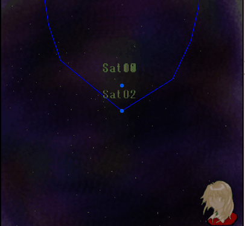

# satellite
How to use the Runge-Kutta method for numerical analysis of gravity-based many-body problems in the theory of relativity using JavaScript in NAS6LIB and how to use x3dom for displaying the results
LIB:
https://github.com/NAS6mixfoolv/NAS6LIB
DEMO:
https://nas6mixfoolv.github.io/NAS6LIB/
https://nas6mixfoolv.github.io/solarsystem/
https://nas6mixfoolv.github.io/satellite/

Jupiter swing-by:

# NAS6LIB: A Versatile Mathematical Library for 3D Graphics and Celestial Mechanics

NAS6LIB is a robust and versatile JavaScript library engineered for **rigorous mathematical computations** in 3D graphics and celestial mechanics. It provides foundational tools for precise calculations related to vectors, matrices, and quaternions, essential for accurately modeling various physical phenomena.

While NAS6LIB itself focuses on computational precision, its capabilities extend to complex applications. For instance, the **`satellite.htm`** demonstration, built upon NAS6LIB, offers a platform to **visually explore relativistic gravitational N-body problems**. This allows users to observe and understand how fundamental theories of relativity subtly yet profoundly influence orbital trajectories, such as Mercury's anomalous perihelion precession.

### Automated Orbital Consistency

NAS6LIB includes powerful tools for 3D graphics and mathematical computations. For celestial orbit simulations, a significant challenge is maintaining the physical consistency of orbital elements. **When users arbitrarily set parameters such as orbital period, masses, or various orbital radii, these values frequently lead to mathematical contradictions within the system. Such inconsistencies inevitably result in unstable orbits or immediate simulation failures—for example, celestial bodies flying off into space or crashing.**

Our **`satellite.htm`** demonstration showcases an **automatic contradiction resolution feature** that adjusts input orbital parameters to ensure physically stable and accurate orbits.

#### The Orbital Element Consistency Algorithm (Conceptual Overview)

The core logic for resolving orbital element inconsistencies can be found in the `myCalc1` function within `satellite.js` on the `satellite.htm` page. This algorithm intelligently adjusts input parameters based on fundamental celestial mechanics, primarily Kepler's Third Law.

It operates in two main patterns, adapting to the provided input:

**Pattern 1: Adjusting Radii based on Period and Masses**
If the **period (P)** and **masses (M1 + M2)** are considered primary, the algorithm:
1.  **Recalculates the semi-major axis (a):** It derives `my1A1` using Kepler's Third Law, where $a^3 = (G(M1+M2)P^2) / (4\pi^2)$. This ensures the semi-major axis is consistent with the given period and masses.
2.  **Adjusts periapsis and apoapsis distances:** Using the newly calculated `my1A1` and the input eccentricity (`my1E`), it recalculates and overwrites the initial periapsis (`my1RA1`) and apoapsis (`my1RA2`) distances. This ensures the orbital radii match the derived semi-major axis and eccentricity:
    * `my1RA2 = my1A1 * (1 + my1E)` (apoapsis distance)
    * `my1RA1 = my1A1 * (1 - my1E)` (periapsis distance)
    This pattern ensures that the orbital radii are consistent with the `period` and `masses`.

**Pattern 2: Adjusting Mass or Period based on Radii**
If the **periapsis (`my1RA1`) and apoapsis (`my1RA2`) distances** are primary, the algorithm:
1.  **Recalculates the semi-major axis (a):** It first derives `my1A1` from the average of `my1RA1` and `my1RA2`: $a = (my1RA1 + my1RA2) / 2.0$.
2.  **Adjusts either mass or period:** Based on user selection, it then either:
    * **Recalculates `my1M1` (mass):** If the period is fixed, it adjusts `my1M1` using Kepler's Third Law: $M1 = (4\pi^2 a^3) / (G P^2) - M2$.
    * **Recalculates `my1P` (period):** If the masses are fixed, it adjusts `my1P` using Kepler's Third Law: $P = 2\pi \sqrt{a^3 / (G (M1 + M2))}$.
    This pattern ensures that the `mass` or `period` (whichever is adjusted) is consistent with the `orbital radii`.

Finally, the algorithm performs additional calculations for orbital velocities (`my1Vst`, `my1VA1`, `my1VA2`) and recalculates the eccentricity (`my1E = (my1RA2 - my1A1) / my1A1`) to ensure overall physical consistency across all derived orbital parameters.

